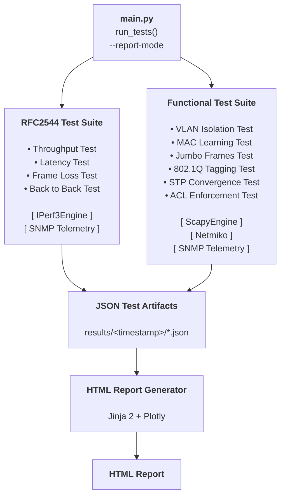

# Network Test Framework

## Project Overview

This project is a Python-based network test harness for validating switch behavior and benchmarking forwarding performance in a lab environment.


It runs two test suites:

- RFC 2544 performance benchmarks (`throughput`, `latency`, `frame_loss`, `back_to_back`)
- Functional switch validation tests (`vlan_isolation`, `mac_learning`, `jumbo_frames`, `dot1q_tagging`, `stp_convergence`, `acl_enforcement`)

Each run writes structured JSON outputs into a timestamped `results/<timestamp>/` folder, and can generate a self-contained HTML report under `reports/`.

## Architecture



## Setup

### Requirements

- Linux environment (or similar Unix shell)
- Python 3.12+
- SSH access to lab hosts and switch devices
- `iperf3` available on traffic generator host
- SNMP access configured for switch telemetry (optional but supported)

### Install dependencies

```bash
cd /home/jimmy/network-test-framework
curl -LsSf https://astral.sh/uv/install.sh | sh
uv venv
source .venv/bin/activate
uv sync
```

### Configure secrets and SSH

- Ensure SSH keys/credentials referenced in `main.py` are valid for your lab.
- Configure lab credentials via the project secrets loader in `framework/lab_secrets.py`.
- Verify remote hosts used by `IPerf3Engine` and `ScapyEngine` are reachable.

## Project Layout

```text
network-test-framework/
├── main.py
├── pyproject.toml
├── plans/
│   └── report_gen.md
├── framework/
│   ├── lab_secrets.py
│   ├── telemetry/
│   │   └── cisco_snmp.py
│   ├── traffic/
│   │   ├── iperf3_engine.py
│   │   ├── scapy_engine.py
│   │   ├── scapy_send.py
│   │   └── scapy_capture.py
│   ├── tests/
│   │   ├── rfc2544.py
│   │   ├── functional.py
│   │   ├── test_rfc2544.py
│   │   └── test_functional.py
│   └── reporting/
│       ├── __init__.py
│       ├── report_generator.py
│       └── templates/
│           └── report.html
├── results/
│   └── <timestamp>/
│       ├── throughput.json
│       ├── latency.json
│       ├── frame_loss.json
│       ├── back_to_back.json
│       └── <functional-test>.json
└── reports/
    └── <timestamp>_report.html
```

## RFC 2544 Tests

Implemented in `framework/tests/rfc2544.py`.

- **Throughput**: Binary search to find the maximum zero-loss bitrate per frame size in `RFC2544_FRAME_SIZES`.
- **Latency**: Measures jitter statistics at configured load percentages, using each frame size's throughput-derived rate.
- **Frame Loss**: Runs a step-down offered-load sweep and captures loss curves per frame size.
- **Back-to-Back**: Runs burst trials at line-rate and estimates no-loss burst frame counts per frame size.

Each RFC test returns a unified result structure with:

- `test`, `passed`, `timestamp`, `duration_sec`
- `switch_counter_delta` (when telemetry is enabled)
- `details` (test-specific metrics)
- `evidence` (raw per-trial/per-run evidence)

## Functional Tests

Implemented in `framework/tests/functional.py`.

- **VLAN Isolation**: Verifies tagged traffic does not leak across VLAN boundaries.
- **MAC Learning**: Validates switch MAC learning and forwarding behavior after learning.
- **Jumbo Frames**: Validates forwarding of large payloads and checks for error counters.
- **802.1Q Tagging**: Confirms VLAN tag preservation/stripping behavior as expected.
- **STP Convergence**: Measures traffic restoration time after induced link disruption.
- **ACL Enforcement**: Applies ACL deny/restore flow and validates traffic block/recovery.

Functional tests use a shared, consistent output schema to simplify reporting and automation.

## Engines

### IPerf3Engine (`framework/traffic/iperf3_engine.py`)

- Runs `iperf3` remotely over SSH on a traffic generator host
- Parses JSON output and normalizes key metrics:
  - bitrate, loss percentage, lost packets, jitter, retransmits, duration
- Serves as the execution backend for RFC 2544 performance tests

### ScapyEngine (`framework/traffic/scapy_engine.py`)

- Deploys/executes Scapy sender and capture scripts on remote hosts
- Coordinates send/capture flows and parses structured JSON responses
- Supports VLAN and protocol-aware packet validation
- Serves as the execution backend for most functional tests

## Running Tests and Report Generation

### Run full test flow

```bash
cd /home/jimmy/network-test-framework
source .venv/bin/activate
python3 main.py
```

This creates a new timestamped results directory:

```text
results/YYYY-MM-DD-HH-MM/
```

### Generate report from latest results

```bash
python3 main.py --report
```

### Generate report from a specific results folder

```bash
python3 main.py --report /home/jimmy/network-test-framework/results/YYYY-MM-DD-HH-MM
```

Output report path pattern:

```text
reports/YYYY-MM-DD-HH-MM_report.html
```

## Results and Reporting Details

- Result files are JSON and stored per test for traceability and automation.
- `main.py` strips heavy `raw_json` blobs from evidence before writing files to keep artifacts manageable.
- `ReportGenerator` loads all JSON files in a selected run directory and renders:
  - Executive summary (pass/fail, duration, headline throughput)
  - RFC 2544 charts/tables (throughput, frame loss, latency, back-to-back)
  - Functional test summary and failed-test evidence
  - Switch telemetry deltas
- Report HTML is self-contained (Plotly JS is embedded inline) for offline viewing.

